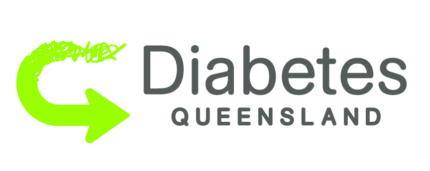
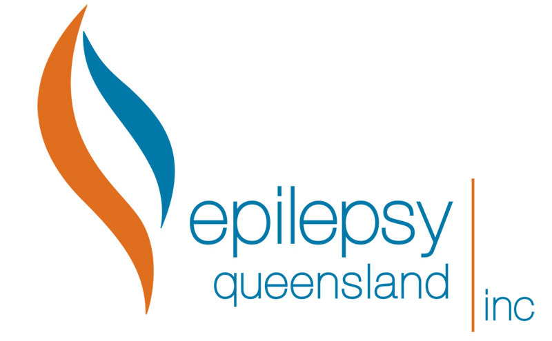
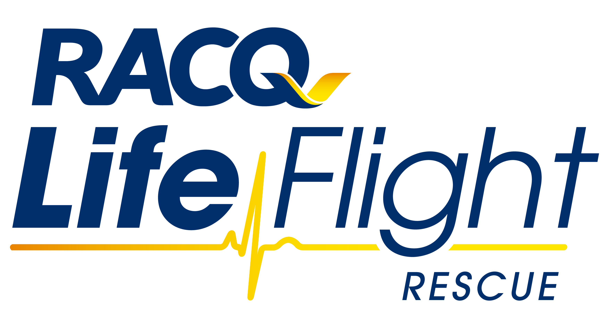

# Big Data Big Heart
Part of what makes Australia great is the way we take care of the most vulnerable people among us. 

    

## What is the Big Data, Big Heart Hackathon?
An event at Fishburners in Brisbane on October 27-29 to produce solutions for Diabetes Queensland, Epilepsy Queensland, and Life Flight, using Amazon Web Services and Big Data. 
 
Prizes include Amazon Echo Dots, IoT Buttons, and **a trip to AWS re:Invent 2017 event in Las Vegas**. Includes Flights, Accommodation and full access to the event.

Other amazing prizes are on offer, including spot and mystery prizes from our generous sponsors!
 
See the [Big Data Big Heart](https://www.bigdatabigheart.com/) website for details or [register here](https://www.eventbrite.com/e/big-data-big-heart-hackathon-tickets-37525415528)!
 

 
## The Challenge Providers 
### Diabetes Queensland
Formed by a group of Queenslanders around a table in the 1960s, Diabetes Queensland provides advocacy, education, and support for the hundreds of thousands of Queenslanders affected by Type 1 and Type 2 Diabetes.

Read [Diabetes Queensland Challenges](https://github.com/bigdatabigheart/2017-challenges/blob/master/DIABETES-CHALLENGES.md).

    

### Epilepsy Queensland
Epilepsy Queensland provides advocacy, research, support, and information to Queenslanders living with epilepsy and their families. People are typically under 6 or over 65 when diagnosed.

Read [Epilepsy Queensland Challenges](https://github.com/bigdatabigheart/2017-challenges/blob/master/CHALLENGES-EPILEPSY_QLD.md).

    

### Life Flight 
Operating 13 helicopters and 5 fixed wing aircraft across Queensland, Life Flight's aeromedical retrieval personnel transport patients from accident sites and remote hospitals to care facilities throughout the State.

Read [Life Flight Challenges - COMING SOON]().

    

## The Challenge Datasets
The following datasets are provided as a starting point.

### Providers' Datasets
Diabetes Queensland, Epilepsy Queensland, and Life Flight have provided some anonymised datasets.
Please be sensitive with the use of this data and do not distribute beyond what is required for this hackathon.

See the [Challenge Datasets](https://github.com/bigdatabigheart/Datasets/tree/master/ChallengeProvidedData).

### Public Datasets
Some publically available datasets for diabetes have been provided.

See the [Public Datasets](https://github.com/bigdatabigheart/Datasets/tree/master/PublicData).

